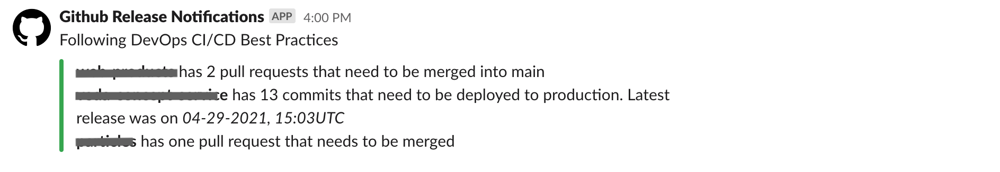
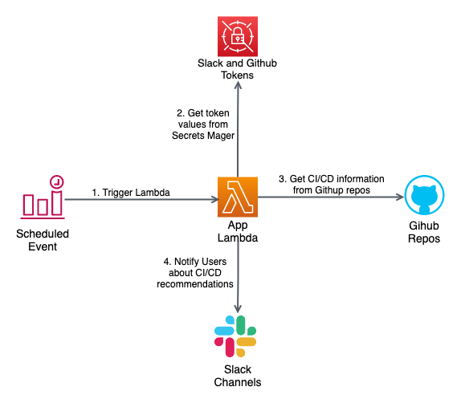

# Welcome to DevOps CI/CD monitor application!

This application notify teams that are working on different Github repositories, if they are not following some of the CI/CD best practices. It makes sure that code is continously released to production and that pull requests are also being merged frequently to ensure continous integration. It assumes, that a release branch (```release-x.y.x```) is created when application code needs to be deployed to a production environment.





## Architecture

The application code runs on a Python Lambda that is invoked on a scheduled specified in a CloudWatch event. All the cloud resources are defined using the [AWS CDK](https://github.com/aws/aws-cdk).  




## Repo Structure

    .
    ├── cdk_infra                    # Cloud application resources (IaC)
    |   |   
    |   ├── lib                      # CDK Stacks and Constructs
    |
    ├── lambda                       # Lambda application code                     
    |   |
    |   |── app                      # Application library and configuration files 
    |   ├── index.py                 # Lambda handler
    |   ├── requirements.txt         # External packages required in the Lambda                           
    |
    └── ...


## How to configure

You will need to open the file [config.py](lambda/app/config.py) and assign the correct values to the variables shown below. Please notice that two secrets will need to be created first for the Github and Slack tokens. 

```
GITHUB_ORGANIZATION
SLACK_CHANNEL_REPOS_MAPPING
GITHUB_ACCESS_TOKEN_SECRET_NAME
SLACK_APP_TOKEN_SECRET_NAME
```

`SLACK_CHANNEL_REPOS_MAPPING` is where you'll specify the relationship between repositories and Slack channels that will be notified. 


## How to deploy

1. `yarn`
2. `yarn cdk deploy`

Please notice that you need to have the following environment variables.

```
AWS_ACCESS_KEY_ID=<personal_aws_key_id>
AWS_SECRET_ACCESS_KEY=<personal_aws_access_key>
AWS_REGION=us-east-1
```

## Additional resources

Github token - https://docs.github.com/en/github/authenticating-to-github/keeping-your-account-and-data-secure/creating-a-personal-access-token  
Slack Application permissions - https://api.slack.com/messaging/sending

## Useful commands

 * `yarn cdk deploy`      deploy this stack to your default AWS account/region
 * `yarn cdk diff`        compare deployed stack with current state
 * `yarn cdk synth`       emits the synthesized CloudFormation template